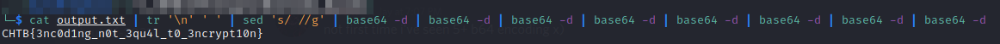

# CTF Challenge Writeup: Nintendo Base64

## Challenge Information

- Name: Nintendo Base64
- Category: Crypto

## Challenge Analysis

The challenge was fairly easy, a file is given with Base64 encoded data. The goal was to find the flag.

## Solution

### Step 1: Analysing and decoding the data

Nintendo has used multiple Base64 encoding functions in a row to 'encrypt/obfuscate' data in the past. The data in this challenge looks exactly the same, and by removing the new lines and decoding it multiple times we get the flag!

## Flag

`CHTB{3nc0ding_n0t_3qu4l_t0_3ncrypti0n}`

## Conclusion

Encoding/obfuscation != Encryption

## Writeup Author

- Twitter: [@Cyber8RU7U5](https://twitter.com/Cyber8RU7U5)
- GitHub: [Cyber8RU7U5](https://github.com/Cuber8RU7U5)

