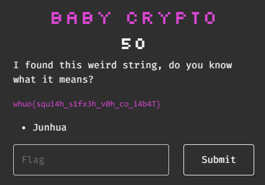

# CTF Challenge Writeup: Baby Crypto

## Challenge Information

**- Name:** Baby Crypto
**- Category:** Crypto
**- Points:** 50
**- Description:** I found this weird string, do you know what it means?

## Challenge Analysis

The string we got looks like it has been rotated with a cipher, the most common one is ROT-13.

## Solution

### Step 1: Rotating the key

By applying the ROT-13 cipher and switching the number till it starts with 'grey', we got the flag.

## Flag

`grey{caes4r_c1ph3r_f0r_my_s4l4D}`

## Conclusion

A perfect example of a 'baby' crypto!

## Resources

- Tool: [CyberChef](https://gchq.github.io/CyberChef/)
- Reference: [Ceasar Cipher](https://en.wikipedia.org/wiki/Caesar_cipher)

## Writeup Author

- Twitter: [@Cyber8RU7U5](https://twitter.com/Cyber8RU7U5)
- GitHub: [Cyber8RU7U5](https://github.com/Cyber8RU7U5)

