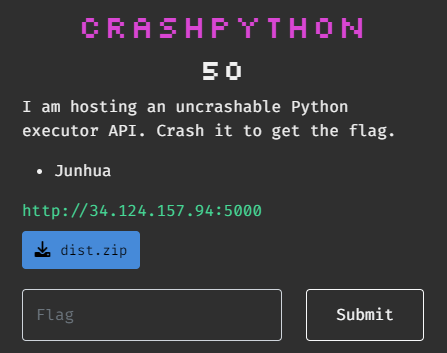
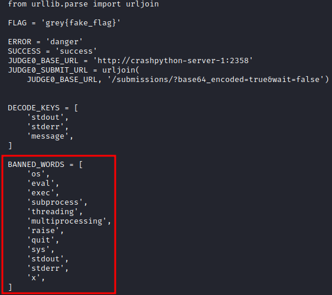
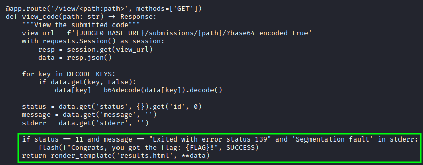

# CTF Challenge Writeup: CrashPython

## Challenge Information

- **Name:** Crash Python
- **Category:** Misc
- **Points:** 50
- **Description:** I am hosting an uncrashable Python executor API. Crash it to get the flag.
- **Files:** [dist.zip](files/crashpython-dist.zip)



## Challenge Analysis

The files contain a environment that is not supposed to crash, our job is to force a crash!

## Solution

### Step 1: Analyze the files and list our restrictions/constrains

We see some words that are actively blacklisted:



### Step 2: Search for flag prerequisites

Inside the 'app.py' file we find the following check:



### Step 3: Write a script

Now it's up to me to write a script that exits with status 139, gives a 'Segmentation fault' and creates status 11:
```python
import ctypes

def segmentation_fault():
    invalid_ptr = ctypes.POINTER(ctypes.c_int)()
    ctypes.memset(invalid_ptr, 0, ctypes.sizeof(ctypes.c_int))

segmentation_fault()
```

Done!

## Flag

`grey{pyth0n-cv3-2021-3177_0r_n0t?_cd924ee8df15912dd55c718685517d24}`

## Conclusion

Good challenge to do when you're stuck on a hard one!

## Writeup Author

- Twitter: [@Cyber8RU7U5](https://twitter.com/Cyber8RU7U5)
- GitHub: [Cyber8RU7U5](https://github.com/Cyber8RU7U5)

