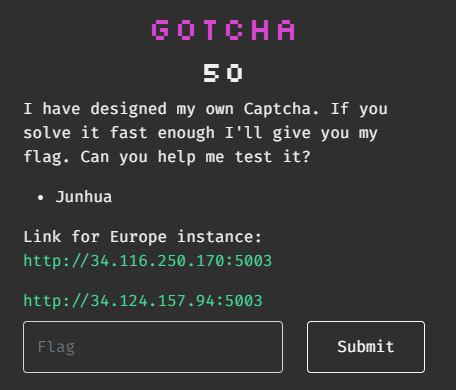

# CTF Challenge Writeup: Gotcha

## Challenge Information

- **Name:** Gotcha
- **Category:** Misc
- **Points:** 50
- **Description:** I have designed my own Captcha. If you solve it fast enough I'll give you my flag. Can you help me test it?



## Challenge Analysis

This page contains a captcha that needs to be solved for +1 point, the score is reset every 120 seconds. My attempt was te reverse engineer the complicated cookie, after some time I noticed that this was **not** part of the challenge and I started to write a bot that auto fills in the captcha codes.
*The environment was immensely unstable and with Tesseract not being 100% accurate it took me 2-3 tries to get enough score in under 120 seconds*

## Solution

### Step 1: Analyze the environment

The web page is very simple:


It's case sensitive and gives us +1 score on a correct captcha:


### Step 2: Design a robot that pretends to be human

There are various ways to approach this, I've used to create my own Machine Learning models before. But this time I wanted to use a more simple approach that doesn't require a lot of time, it's just less accurate: **Tesseract**

Simple design:
- Connect to the server
- Save the cookie as a session
- Go into this loop:
	- Check the Captcha with Tesseract (Only uppercase letters)
	- Send a POST request with the Captcha
	- Save the new cookie as a session
	- Print the score
	- Check for any flags in the page
		- `quit()`

### Step 3: The (human) robot

This is the code that has been designed:
```python
import io
import re
import base64
import requests
import pytesseract
from PIL import Image

# TARGET
url = "http://34.124.157.94:5003/"

# TESSERACT SETTINGS
custom_config = r'-c tessedit_char_whitelist=ABCDEFGHIJKLMNOPQRSTUVWXYZ --psm 6'

# ADDED BECAUSE OF INSTABILITY, POSSIBLE RATE LIMITING FOR REQUESTS
headers = { 'User-Agent': 'Captcha BOT, give me the FLAG!', }

# FLAG PATTERN
flag_pattern = r'grey\{.*?\}'

# INITIATE SESSION
session = requests.Session()
response = session.get(url, headers=headers)
session.cookies.update(response.cookies)

# MARKERS FOR IMAGE EXTRACTION
start_marker = 'src="data:image/jpeg;base64,'
end_marker = '"'

# SET INITIAL POST TO NOTHING
text = ''

# START MAIN LOOP
while True:
        # POST DATA
        data = { 'captcha': text }
        response = session.post(url + "submit", data=data, headers=headers)
        
        # EXTRACT IMAGE
        start_index = response.text.find(start_marker) + len(start_marker)
        end_index = response.text.find(end_marker, start_index)
        image_base64 = response.text[start_index:end_index]
        image_data = base64.b64decode(image_base64)
        image = Image.open(io.BytesIO(image_data))

        # SOLVE CAPTCHA
        text = pytesseract.image_to_string(image, config=custom_config)
        text = text.replace('\n', '')

        # CHECK FOR FLAG
        if re.search(flag_pattern, response.text):
            print('FLAG FOUND')
            print(response.text)
            quit()

        # DEBUG INFO (Tesseract is not very accurate, 70-80%)
        score_pattern = r'<h3>Score: (.*?)</h3>'
        score = re.findall(score_pattern, response.text)
        if score:
            print("Score:", score[0])

        # UPDATE SESSION
        session.cookies.update(response.cookies)
```


## Flag

`grey{I_4m_hum4n_n0w_059e3995f03a783dae82580ec144ad16}`

## Conclusion

Always love these kind of challenges, simple but fun. Only downside was the instability of the environment, so it was hard to correctly test the script. (Environment had a lot of DoS moments)

## Resources

- Tool: [pytesseract](https://pypi.org/project/pytesseract/)

## Writeup Author

- Twitter: [@Cyber8RU7U5](https://twitter.com/Cyber8RU7U5)
- GitHub: [Cyber8RU7U5](https://github.com/Cyber8RU7U5)

