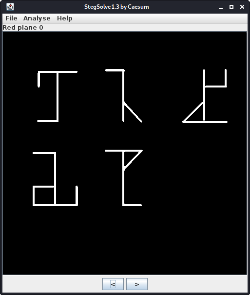

# CTF Challenge Writeup: Mah Eyes are RED


## Challenge Information

- Name: Mah Eyes are RED
- Category: Stegonography

## Challenge Analysis

A picture is given and the challenge name seems to have something to do with it...


The title of the challenge includes a capitalized word 'RED', this gives us a slight hint that something might be hidden on the 'Red plane' of the image.

## Solution

### Step 1: Analyze the file

We can use the **Stegsolve v1.3** by Caesum to analyze the file. During this proces we see that 'Red plane 0' contains some sort of cipher:



### Step 2: Decoding the symbols

After some intense searching, I've found an interesting cipher called the **Cistercian Numerals**:


The symbols present us with the following numbers:

```
107 104 105 108 97 100 115
```

### Step 3: Decoding the numbers

I used python to decode this information:

```
python3 -c "print(chr(107) + chr(104) + chr(105) + chr(108) + chr(97) + chr(100) + chr(115))"
```


### Step 4: Using the key

After a failing at decoding the image with the key, I've tested multiple different mutations of the key.
Instead of 'khilads' I needed to use 'khiladi' with dynamic settings to extract a new image:


## Flag

`ICTF{Gr33n_Pl4nt_G0_Brrrr}`

## Resources


- Tool: [Stegsolve v1.3](http://www.caesum.com/handbook/Stegsolve.jar)
- Reference: [Cistercian numerals](https://en.wikipedia.org/wiki/Cistercian_numerals)

## Writeup Author

- Twitter: [@Cyber8RU7U5](https://twitter.com/Cyber8RU7U5)

